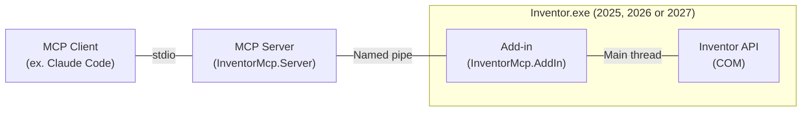

# Autodesk Inventor MCP Server

An MCP server that lets Claude inspect and drive a live Autodesk Inventor session, 2025 through 2027.
It is built for developing Inventor plugins and automation, so Claude can see what a running automation loop creates, in order, as it runs.

## Architecture



| Hop | Transport | Notes |
| --- | --- | --- |
| Client to server | stdio | Claude Code, Claude Desktop, Visual Studio or Visual Studio Code starts the server with `dotnet tool exec`. |
| Server to add-in | Named pipe `InventorMcp.Bridge.<year>`, one for each Inventor release | Only the current Windows user can connect. |
| Add-in to Inventor | In-process COM | Every call runs on Inventor's main thread. |

The server targets `net10.0`. The add-in targets `net8.0-windows` on Inventor 2025 and 2026, and `net10.0-windows` on 2027.
The server holds every MCP tool. The add-in is only a thin bridge: pipe listener, dispatch, and main thread marshaling.

The add-in stays thin on purpose.
Changing it costs an Inventor restart, while the tool surface changes constantly during development.

## Documentation

| Path | Audience |
| --- | --- |
| `Docs/Setup-and-Usage-Guide.md` | Users: install, connect Claude, what to ask for, troubleshooting |
| `Docs/Plugin-Development-Loop.md` | Plugin developers: running and iterating on a plugin in a live session, and making a plugin ready for it |
| `Docs/Architecture.md` | Users: how it is built and why those decisions were made |
| `Source/InventorMcp.Server/DialogSettings.jsonc` | Users: how the server answers each Inventor dialog that blocks a call (ex. the iLogic Security Alert). Edit it for your choice. See "Dialog settings". |
| `Docs/Research/` | Maintainers: findings and measurements that tasks and decisions come from. Kept after the task is done. |
| `Docs/Tasks/` | Outstanding work, one document per item. Absent when nothing is outstanding. |
| `AGENTS.md` | Coding agents (ex. Claude Code, Copilot in Visual Studio Code): the working principles, and an index of the rules to open on demand |
| `.agents/rules/` | Coding agents: the Inventor behaviours and repository rules, one topic per file |

### Which coding agents read `AGENTS.md`

`AGENTS.md` sits at the repository root, where each agent that supports it looks.

| Agent | Reads the root `AGENTS.md` |
| --- | --- |
| Claude Code | Yes, from v2.1.277, when no `CLAUDE.md`, `.claude/CLAUDE.md` or `CLAUDE.local.md` exists in the working folder or above it. Not in a session with telemetry disabled, on a third-party provider (ex. Amazon Bedrock), or in the first session after an upgrade. |
| GitHub Copilot in Visual Studio Code | Yes, through the setting `chat.useAgentsMdFile`. |
| GitHub Copilot in Visual Studio | No. It reads `.github/copilot-instructions.md`, which this repository does not have. |

The name `.agents/` has no special meaning to any tool. It is only a neutral folder that keeps the agent rules apart
from `Docs/`, which is written for people. No agent reads `.agents/` by itself: `AGENTS.md` lists each rule with its
trigger, and an agent opens a rule only when a task matches it. So the rules cost no context until they are needed.

## Projects

| Project | Purpose |
| --- | --- |
| `Source/InventorMcp.Contracts` | The pipe wire contract. Holds no Inventor interop, so the server builds without Inventor installed. |
| `Source/InventorMcp.AddIn` | The Inventor add-in. Owns the pipe listener and main thread dispatch only. |
| `Source/InventorMcp.AddIn.Loader` | Isolates the add-in on Inventor 2025 and 2026, which cannot do it themselves. Unused on 2027. |
| `Source/InventorMcp.Server` | The MCP server. Owns every tool. |
| `Libs/Inventor/<version>` | The vendored Inventor interop assembly per release, so a machine without Inventor can still build. |

## Requirements

- .NET 10 SDK
- Autodesk Inventor 2025, 2026 or 2027 to run. Not needed to build, because the interop assemblies are vendored under `Libs`.

The Inventor release is chosen per build with `-p:AutodeskVersion=<year>`. The default, 2027, is in `Directory.Build.props`.
Only the add-in is built per release. The server and the contract are built once.

## Setup

Build everything and deploy the add-in manifest:

```
dotnet build InventorMcp.slnx
dotnet build Source/InventorMcp.AddIn/InventorMcp.AddIn.csproj -p:AutodeskVersion=2027 -p:DeployAddIn=true
```

The second command writes `InventorMcp.AddIn.addin` to `%APPDATA%\Autodesk\Inventor 2027\Addins`.
`AutodeskVersion` selects the release and defaults to 2027. Supported: 2025, 2026, 2027.
The manifest points at the build output, so later rebuilds need no redeployment.
Building a release does not install it. Run the deploy command once for each release you use.

The Debug build of the server also adds a tool package to `%LOCALAPPDATA%\InventorMcp\Feed`, which the development
setup of every client starts the server from. The feed is empty until the first build, so build before you connect
a client. See "Connecting a client".

Restart Inventor.
Confirm the bridge started by checking `%LOCALAPPDATA%\InventorMcp\<year>\addin.log`, ex. `2027\addin.log`.

## Connecting a client

The server is a stdio MCP server, so the client starts it. There is nothing to leave running and no port.
Claude Code, Claude Desktop, and GitHub Copilot Chat in Visual Studio and in Visual Studio Code can all use it.

Each client is configured **machine wide**, in its own user configuration file, so the server is available in every
folder, repository and solution. The repository holds no client configuration.

### How a client starts the server

Every client runs the server as a .NET tool:

```
dotnet tool exec InventorMcp.Server [--prerelease] --source <feed> --yes
```

with `DOTNET_NOLOGO=1` and `DOTNET_CLI_TELEMETRY_OPTOUT=1` in the environment.

- NuGet extracts each package version to its own cache folder and the server runs from there. No client runs the
	build output, so a rebuild succeeds while clients are connected.
- With no version given, `dotnet tool exec` runs the newest package in the feed. A client picks up a new version
	when it restarts the server.
- `--source` makes the feed the only source for that call, so a package of the same name on nuget.org is never used.
- `--yes` removes a confirmation prompt that nobody can answer, because the client owns stdin.
- `DOTNET_NOLOGO` stops the first run banner, which `dotnet` writes to stdout and which would corrupt the protocol.

The server sends the modelling rules (named faces, units, extent direction, health checks, call length) in its
`initialize` response, so every client gets them. The text is `Source/InventorMcp.Server/ServerInstructions.md`.

### Two setups

| | Using the server | Developing the server |
| --- | --- | --- |
| Who | Anyone who uses the tools, ex. a team member | Anyone who changes the server in this repository |
| Feed | A team feed: a file share or an internal NuGet feed | `%LOCALAPPDATA%\InventorMcp\Feed`, filled by each Debug build |
| Versions | Releases (ex. `0.1.0`), so no `--prerelease` | `0.1.0-dev.<UTC time>`, so `--prerelease` |
| New version | When a release is published to the feed | After every build that changes the server |
| Needs the repository | No | Yes |

Both setups need the Inventor add-in installed for each release in use. See "Setup" and "Bundle deployment".

No team feed and no release pipeline exist yet. The "Using the server" examples show where the team feed goes.
`<team feed>` is its path or URL, ex. `\\server\share\InventorMcp` or
`https://pkgs.dev.azure.com/<organisation>/_packaging/<feed>/nuget/v3/index.json`. A feed that needs a sign-in also
needs a NuGet credential provider on each machine.
Write a UNC path with doubled backslashes inside JSON, ex. `\\\\server\\share\\InventorMcp`.

The team feed is the same text on every machine, so each "Using the server" entry needs no variable.
The local feed differs per user, and the four clients differ in how they name a per user folder:

| Client | Configuration file | Local feed in the development setup |
| --- | --- | --- |
| Claude Code | `~/.claude.json`, user scope | `${LOCALAPPDATA}/InventorMcp/Feed` |
| Claude Desktop | `%APPDATA%\Claude\claude_desktop_config.json` | Absolute path. No variables. |
| Visual Studio | `%USERPROFILE%\.mcp.json` | Absolute path. It passes `${env:...}` through as text. |
| Visual Studio Code | `%APPDATA%\Code\User\mcp.json` | `${env:LOCALAPPDATA}\\InventorMcp\\Feed` |

In the examples, replace `<you>` with your Windows user name.

### Claude Code

Add the server at user scope from any terminal. It is then available in every folder.

**Using the server:**

```
claude mcp add-json autodesk-inventor-mcp-server -s user '{"type":"stdio","command":"dotnet","args":["tool","exec","InventorMcp.Server","--source","<team feed>","--yes"],"env":{"DOTNET_NOLOGO":"1","DOTNET_CLI_TELEMETRY_OPTOUT":"1"}}'
```

**Developing the server:**

```
claude mcp add-json autodesk-inventor-mcp-server -s user '{"type":"stdio","command":"dotnet","args":["tool","exec","InventorMcp.Server","--prerelease","--source","${LOCALAPPDATA}/InventorMcp/Feed","--yes"],"env":{"DOTNET_NOLOGO":"1","DOTNET_CLI_TELEMETRY_OPTOUT":"1"}}'
```

- To change an entry, run `claude mcp remove autodesk-inventor-mcp-server -s user` first, then add it again.
- In Git Bash, `claude mcp add-json` rejected JSON with escaped backslashes. Forward slashes in a path worked.
- Check it with `claude mcp list`, which starts each server and reports Connected or Failed.
- After a server change, run `/mcp` and Reconnect. A change inside an existing tool then appears. A new or changed
	tool can need a new session.
- An entry of the same name at another scope (ex. a project `.mcp.json`) must be the same text, or `/mcp` reports
	"Conflicting scopes".
- An entry that still runs `bin\Debug\InventorMcp.Server.exe` locks the build output. Replace it.

### Claude Desktop

Open Settings, Developer, Edit Config. That opens the correct file, also for a Microsoft Store installation, which
keeps it in a different folder. Add the entry to `mcpServers`.

**Using the server:**

```json
{
	"mcpServers": {
		"autodesk-inventor": {
			"command": "dotnet",
			"args": [
				"tool", "exec", "InventorMcp.Server",
				"--source", "<team feed>",
				"--yes"
			],
			"env": {
				"DOTNET_NOLOGO": "1",
				"DOTNET_CLI_TELEMETRY_OPTOUT": "1"
			}
		}
	}
}
```

**Developing the server:**

```json
{
	"mcpServers": {
		"autodesk-inventor": {
			"command": "dotnet",
			"args": [
				"tool", "exec", "InventorMcp.Server",
				"--prerelease",
				"--source", "C:\\Users\\<you>\\AppData\\Local\\InventorMcp\\Feed",
				"--yes"
			],
			"env": {
				"DOTNET_NOLOGO": "1",
				"DOTNET_CLI_TELEMETRY_OPTOUT": "1"
			}
		}
	}
}
```

- Quit Claude Desktop from the tray and start it again after each change, including a server change. Closing the
	window leaves it running.
- Settings, Developer shows the server as Running when it started.
- Claude Desktop starts two servers from one entry, one for chat and one for agent mode. Each uses a pipe connection
	once it calls Inventor. See "More than one client".
- A failed start is logged in `%APPDATA%\Claude\logs\mcp-server-autodesk-inventor.log`.

### Visual Studio

Needs Visual Studio 2022 17.14 or later, or Visual Studio 2026, with Copilot Chat in **Agent** mode.
Ask mode does not call tools.

Add the entry to `servers` in `%USERPROFILE%\.mcp.json`, which Visual Studio reads for every solution. Create the file
if it does not exist. Keep any servers already in it.

**Using the server:**

```json
{
	"servers": {
		"autodesk-inventor-mcp-server": {
			"type": "stdio",
			"command": "dotnet",
			"args": [
				"tool", "exec", "InventorMcp.Server",
				"--source", "<team feed>",
				"--yes"
			],
			"env": {
				"DOTNET_NOLOGO": "1",
				"DOTNET_CLI_TELEMETRY_OPTOUT": "1"
			}
		}
	}
}
```

**Developing the server:**

```json
{
	"servers": {
		"autodesk-inventor-mcp-server": {
			"type": "stdio",
			"command": "dotnet",
			"args": [
				"tool", "exec", "InventorMcp.Server",
				"--prerelease",
				"--source", "C:\\Users\\<you>\\AppData\\Local\\InventorMcp\\Feed",
				"--yes"
			],
			"env": {
				"DOTNET_NOLOGO": "1",
				"DOTNET_CLI_TELEMETRY_OPTOUT": "1"
			}
		}
	}
}
```

- Visual Studio does not expand variables in this file. `${env:LOCALAPPDATA}` reaches `dotnet` as text, relative to
	the solution folder, so the feed path must be absolute.
- Trust the server when asked, then turn its tools on in the tools picker. Visual Studio adds them turned off.
- After a server change, restart the server from the CodeLens in `%USERPROFILE%\.mcp.json`.
- From 18.7, Visual Studio asks for trust again when the server's instructions or tools change.
- If the tools picker shows no MCP servers, check the organisation policy "MCP servers in Copilot" first.
- The log is in `%TEMP%\VSGitHubCopilotLogs\`. A failed start there quotes the server's stderr.

### Visual Studio Code

Needs GitHub Copilot Chat in **Agent** mode. Ask mode does not call tools.

Run "MCP: Open User Configuration", which opens `%APPDATA%\Code\User\mcp.json`, and add the entry to `servers`.
It is then available in every folder and workspace.

**Using the server:**

```json
{
	"servers": {
		"autodesk-inventor-mcp-server": {
			"type": "stdio",
			"command": "dotnet",
			"args": [
				"tool", "exec", "InventorMcp.Server",
				"--source", "<team feed>",
				"--yes"
			],
			"env": {
				"DOTNET_NOLOGO": "1",
				"DOTNET_CLI_TELEMETRY_OPTOUT": "1"
			}
		}
	}
}
```

**Developing the server:**

```json
{
	"servers": {
		"autodesk-inventor-mcp-server": {
			"type": "stdio",
			"command": "dotnet",
			"args": [
				"tool", "exec", "InventorMcp.Server",
				"--prerelease",
				"--source", "${env:LOCALAPPDATA}\\InventorMcp\\Feed",
				"--yes"
			],
			"env": {
				"DOTNET_NOLOGO": "1",
				"DOTNET_CLI_TELEMETRY_OPTOUT": "1"
			}
		}
	}
}
```

- After a server change, restart the server from "MCP: List Servers".
- Automatic restart (`dev.watch`) works only from a workspace file (`.vscode/mcp.json`) with a path relative to the
	workspace, ex. `"watch": "Source/InventorMcp.Server/obj/Debug/LocalFeed.stamp"`, which the build touches after it
	packs. In the user file it did not fire, neither with `${workspaceFolder}` nor with an absolute path. The
	repository commits no workspace file. A developer who wants the automatic restart can add one locally, but it then
	defines a second entry beside the user entry.
- Trust the server on its first start.
- "MCP: List Servers" starts, stops and restarts the server, and "Show Output" opens its log with the server's stderr.
- "MCP: Reset Cached Tools" clears the tool list Visual Studio Code keeps. Use it when a new tool does not appear.
- The tools picker lists the server as `InventorMcp.Server`, the name the server reports about itself.
- If `chat.mcp.discovery.enabled` includes `claude-desktop`, Visual Studio Code also lists the server from the
	Claude Desktop configuration, and each copy starts its own server.

### More than one client

Each client starts its own server, and Claude Desktop starts two. A server opens a pipe connection on its first
Inventor call. The add-in accepts 16 connections at once and runs every call on Inventor's main thread, so a call
from one client waits while another client's call runs, then succeeds.

- Every client sees the same `inventor_activity` feed. Each keeps its own cursor (`nextSequence`), and reading
	removes nothing.
- A server that finds every connection in use waits 3 s, then returns `inventor-not-running` with a message that
	says Inventor is running and not to call `inventor_start`.

## Inventor must be running

The add-in hosts the named pipe, so the bridge exists only while Inventor is open with the add-in loaded.

With Inventor closed, every tool returns a readable `inventor-not-running` result:

```
No Inventor session is hosting the MCP bridge. Ask the user whether to start Inventor, then call inventor_start.
If Inventor is already open, make sure the Inventor MCP Bridge add-in is loaded.
```

The MCP server itself still starts and lists its tools, so the connection stays healthy while Inventor is closed.
That is the reason for the two process design.

### Starting Inventor from Claude

`inventor_start` starts Inventor, only when you ask for it. It offers only releases that have the add-in deployed.

- One such release: it starts with no question.
- More than one: Claude Code shows a form with "Autodesk Inventor 2025", "2026" and "2027".
	A client that cannot show a form returns `version-required`, and Claude asks you instead.
- The release already running, with or without the bridge: nothing starts. A different release that runs does not
	stop the start.
- After a start, this session uses the release it started. See "More than one Inventor release".

Inventor starts with Explorer as its parent, so closing Claude does not close Inventor.
The call waits up to 45 s for the add-in. After that it returns `still-starting`, because a sign-in or recovery
dialog can hold Inventor, and `inventor_session` connects later.
Set `INVENTOR_MCP_RELEASES` (ex. `2025`) on the server to limit the releases it considers.

### More than one Inventor release

Inventor 2025, 2026 and 2027 can run at the same time. Each add-in listens on its own pipe, and each Claude session
uses one release.

- `inventor_start` with `version` starts a release next to the others, and sets the release of the session.
- `inventor_use_release` sets it with no start. A version of 0 clears the choice.
- `INVENTORMCP_RELEASE` in the `env` of the MCP entry fixes the release for a project, ex.
	`claude mcp add-json ... -s local`. The repository holds no client configuration, so this is your choice.
- With none of these, the server uses the one release that runs. When more than one runs, a tool returns
	`release-required` with the years, and Claude asks you.

A chosen release never falls back to another release. If its Inventor is closed, the result is `inventor-not-running`
and names the release. Two Inventor processes of the same release still compete for one pipe.

| Error | Meaning |
| --- | --- |
| `release-required` | More than one release runs, and this session has not chosen one. Call `inventor_use_release`. |
| `bridge-outdated` | An Inventor hosts an add-in from before protocol version 2, which uses the old pipe name. Close Inventor, redeploy the add-in for each release, and start it again. |

A Claude session that started before an upgrade keeps its old server, with the old pipe name, until you restart it.

### Debugging the add-in

The add-in project sets `StartProgram` to Inventor, so pressing F5 on it launches Inventor with the debugger attached.
Deploy the manifest once first, otherwise Inventor has nothing to load.

**Inventor must be closed to rebuild the add-in.**
Unloading it through the Add-In Manager runs `Deactivate` but does not release the assembly,
because Inventor's assembly load context is not collectible, so the build still fails with a file lock.

This is the reason the add-in stays thin.
Every line in it costs a CAD restart to change, while the server's tools can be changed freely.

### Bundle deployment

For a release style install, which does not point back into a build folder:

```
dotnet build Source/InventorMcp.AddIn/InventorMcp.AddIn.csproj -c Release -p:AutodeskVersion=2027 -p:DeployBundle=true
```

This writes a self contained bundle to `%APPDATA%\Autodesk\ApplicationPlugins\InventorMcp.AddIn`, which is version
independent. Run it once per release: each adds its own manifest and `Contents` subfolder, and every Inventor loads
only the manifest gated to its own version.
Use one form or the other, not both, or Inventor loads the add-in twice.

### Assembly isolation

The manifest sets `UseInventorAssemblyContext` to `0`, which loads the add-in in its own `AssemblyLoadContext`.
The element names whether to use *Inventor's* context, so `0` is the isolated mode.
This keeps the add-in's dependencies from clashing with the versions Inventor and other vendors' add-ins load into the same process.

Inventor 2025 and 2026 ignore that element.
There, the manifest names `InventorMcp.AddIn.Loader`, which loads the add-in from an `App\` subfolder into an isolated context.

The `Autodesk.Inventor.Interop` reference must stay `Private=false` for this to work.
The interop has to resolve from Inventor itself, while the add-in's own packages resolve from its output folder.

## Tools

| Tool | Purpose |
| --- | --- |
| `inventor_session` | Is Inventor reachable, which version, which document is active, the active project, and which open documents are modifiable |
| `inventor_start` | Start an Inventor release when its bridge is not running, asking which release when several can, and use it |
| `inventor_use_release` | Choose the Inventor release this session talks to, with no restart of the server |
| `inventor_documents` | Every open document with path, type, and unsaved state |
| `inventor_close_documents` | Close the open documents under a folder, drawings first, and never one outside it |
| `inventor_file_info` | Saved release, model states, iProperties, work points and iMates of many files, in pages |
| `inventor_test_copy` | Copy a document tree to a test folder through Apprentice, and point the copies at each other |
| `inventor_assembly_tree` | Occurrence tree with suppression, visibility, and referenced files |
| `inventor_parameters` | Parameters with kind, expression, display value, and internal value |
| `inventor_set_parameter` | Set one parameter and rebuild |
| `inventor_set_parameters` | Set many parameters with one rebuild, optionally with iLogic rules off and one rule after |
| `inventor_evaluate_expression` | Ask Inventor what an expression evaluates to, without writing it |
| `inventor_properties` | iProperties, optionally limited to one set |
| `inventor_set_property` | Set one iProperty |
| `inventor_health` | Rebuild state, sick features, error manager contents |
| `inventor_features` | Every feature with type, suppression, health and parameters, and the definition of each pattern |
| `inventor_pattern_elements` | The transform of each element of a pattern or mirror |
| `inventor_hole_check` | The holes of a part from its geometry, by diameter, with their axes |
| `inventor_styles` | The styles of a drawing or a part, with a diff against a second document |
| `inventor_update` | Rebuild a document |
| `inventor_activity` | Ordered feed of Inventor events, including every committed transaction |
| `inventor_eval_csharp` | Run a C# snippet against the live Inventor API |
| `inventor_run_ilogic` | Run an iLogic rule body, in VB.NET, or a rule of the document by name |
| `inventor_ilogic_rules` | The iLogic rules of a document, with the active flag and the length |
| `inventor_ilogic_rule_get` | Read one rule, or write every rule of a document to files |
| `inventor_ilogic_rule_set` | Change a rule at a unique anchor, with a backup and a diff |
| `inventor_api_lookup` | Search Autodesk's Inventor API documentation. Works with Inventor closed. |
| `inventor_skill` | List or read the server's guides (skills) for a topic or a workflow. Works with Inventor closed. |
| `inventor_orientation` | Resolve each ViewCube face to a world direction for the active document |
| `inventor_run_plugin` | Run a method from a plugin's build output, loaded fresh each call, so a code change needs no restart |
| `inventor_drawing_layout` | Measure a drawing's views, balloons, dimensions and tables, and report collisions |
| `inventor_export_sheet_image` | A drawing sheet, or a region of it, as PNG image content |
| `inventor_auto_balloon` | Replace the balloons of one assembly view: one per part, sides chosen per part or limited, in one Undo step |
| `inventor_dialogs` | The modal dialogs that block Inventor, with their text and buttons. Works while Inventor is blocked. |
| `inventor_dialog_click` | Click one visible button of a blocking dialog. Marked destructive, so a client can ask first. |

## Executing code

`inventor_eval_csharp` is the general purpose tool. It reaches every member of the Inventor API, so it covers
everything the narrower tools do not, such as creating sketches, features, and geometry.

The snippet is Roslyn script code rather than a full class.
`Application` and `Document` are in scope, `System`, `System.Collections.Generic`, `System.Linq` and `Inventor`
are imported, and `Log(...)` records a line for the caller.
`Document` is null when no document is open, and the snippet still runs, so it can create documents or run a
plugin that opens its own. `inventor_run_ilogic` still needs a document, because an iLogic rule is attached to one.

The same tool can run a plugin under development inside the live session, with no Inventor restart per change.
`inventor_run_plugin` packages that loop as one call. See `Docs/Plugin-Development-Loop.md`.

`inventor_api_lookup` answers what a member is called and what it takes, before a snippet is written.
It reads the vendored documentation file, so it needs no Inventor session.

### Safeguards

Arbitrary execution inside a CAD process is the most dangerous capability here, so it is bounded:

- Every snippet is appended to `%LOCALAPPDATA%\InventorMcp\executed-code.log`, with a timestamp and the target document.
- Execution is refused when the document has unsaved changes, unless `allowUnsavedChanges` is passed.
	Unsaved work cannot be recovered if a snippet damages it.
- Roslyn loads on first use only, so a read-only session never pays for it inside Inventor's process.
- Execution runs inside a `SilentOperationScope`, so a dialog cannot stall the dispatcher.

A snippet that throws is reported as a result, with its exception type and message, rather than failing the call.
Compiler errors come back as diagnostics.

## Units and parameter kinds

Inventor stores every length in centimetres and every angle in radians, whatever a document displays.
Parameter results therefore carry `internalValue` in those units alongside `expression` and `displayValue`.

Not every parameter is numeric.
Each one reports a `valueKind` of `Numeric`, `Text`, `Boolean`, or `Unknown`, because a write uses a different accessor for each.
A text parameter has no internal value, and its expression is returned with the surrounding quotation marks removed.

## Writes and dialogs

A modal dialog owns Inventor's message pump, and the bridge posts its work to that pump.
So an unanswered dialog stalls every tool except `inventor_activity`, which reads plain managed memory.

Write operations therefore run with `SilentOperation` set, and restore the previous value afterwards.
Inventor answers a suppressed dialog with its own default, which is a real behaviour change, so reads never suppress anything.

`SilentOperation` does not stop every dialog (ex. the iLogic error dialog). So the server watches from outside
Inventor's process while a call waits. After 3 s, and then every 2 s, it checks whether the Inventor main window is
disabled. If it is, the server reads each dialog with UI Automation (text, buttons, radio buttons and check boxes),
writes it to the server log, and answers it as the dialog settings say:

- A dialog type with a button in the settings gets that button. The call then continues, and the result lists the
	dialog and the click in `blockingDialogs`.
- A dialog type set to `"Ask"`, a dialog that is not in the settings, or a dialog with a button that the server has
	not seen before stays open. The call stops with `blocked-by-dialog`, the dialog text and its buttons.
	`inventor_dialogs` reads it, and `inventor_dialog_click` clicks the button that the user chose.

The server answers only a dialog that blocks one of its own calls, never one that comes after your own action.

### Dialog settings: choose how each dialog is answered

**Edit `Source/InventorMcp.Server/DialogSettings.jsonc` to choose the answer to each dialog.** It is the one place
that sets this. Each entry is a dialog type, and its value is the button that the server clicks, or `"Ask"` to leave
the dialog for you. The comment above each entry lists the values it accepts. A change needs a build, because the
server embeds the file.

| Entry | Dialog | Default | Other values |
| --- | --- | --- | --- |
| `iLogicError` | "Error on line N in rule: ...", after a rule throws | `"OK"` | `"Ask"` |
| `iLogicCompileError` | "Rule Compile Errors in ...", when a rule does not compile | `"OK"` | `"Ask"` |
| `messageBox` | A Win32 message box with only `OK` | `"OK"` | `"Ask"` |
| `dotNetDisposedObjectError` | "Microsoft .NET", "Cannot access a disposed object.", which can come after an iLogic error | `"Continue"` | `"Ask"` |
| `migration` | "Data Format Has Changed", when a save migrates files to the running release | `"Ask"` | `"OK"` |
| `iLogicSecurityAlert` | "Security Alert", "iLogic has disabled a potentially harmful rule." | `"Run the rule"` | `"Don't run the rule"`, `"Ask"` |
| `iLogicSecurityAdvisor` | "iLogic Security Advisor", which comes after "Run the rule" | `"OK"` | `"Ask"` |

Before you change a default, know what each click does:

- `migration` `"OK"` saves the files in the running release's format, which earlier releases cannot open. Leave it
	`"Ask"` when files go to an older Inventor (ex. a Design Automation engine).
- `iLogicSecurityAlert` `"Run the rule"` runs a rule that iLogic flagged as potentially harmful, ex. one that reads the
	registry or writes files. Set it to `"Ask"` if rules can come from files that you do not trust.
	`"Don't run the rule"` disables the rule until you enable it in Tools > Options > iLogic Configuration.
- `iLogicSecurityAdvisor` `"OK"` trusts that one rule on this machine from now on. The server clicks it only when
	"Assume that this external rule is safe" is selected, never when the option for all rules in the folder is.
	You can remove a trusted rule in Tools > Options > iLogic Configuration > Security.

**Your own settings, with no build.** Put a file of the same name, `DialogSettings.jsonc`, in
`%LOCALAPPDATA%\InventorMcp\`. Each entry in it replaces the entry of the same name in the repository file, ex.
`{ "iLogicSecurityAlert": "Ask" }`. The server reads it again at each dialog, so a change has an effect at once.
Use it when you run the server from a team feed. A file that the server cannot read makes every dialog `"Ask"`, and
`inventor_dialogs` lists the problems in `dialogSettingsProblems`.

Two environment variables on the server still work, and apply after both files:
`INVENTORMCP_AUTOCLOSE_DIALOGS=false` makes every dialog `"Ask"`, and `INVENTORMCP_ACCEPT_MIGRATION_DIALOG=true` makes
`migration` `"OK"`.

To add a dialog type, read a real example first, then add it to `Services/DialogPolicy.cs` and to the settings file.
See `Docs/Research/Blocking-Dialog-Detection.md`.

## Logs

| Path | Contents |
| --- | --- |
| `%LOCALAPPDATA%\InventorMcp\<year>\addin.log` | Add-in lifecycle and handler failures of that release |
| `%LOCALAPPDATA%\InventorMcp\<year>\addin-startup.log` | Loader failures on 2025 and 2026, before `addin.log` exists |
| `%LOCALAPPDATA%\InventorMcp\<year>\executed-code.log` | Every snippet run through the execution tools, and each dialog the server clicked |
| `%LOCALAPPDATA%\InventorMcp\server-<date>.log` | MCP server activity, one file for each server process. Each tool call has a line with the release it used. |
| `%LOCALAPPDATA%\InventorMcp\addin.log`, `executed-code.log` | From before the folder for each release, or written before the release was known |
| `%APPDATA%\Claude\logs\mcp-server-autodesk-inventor.log` | Claude Desktop: a server that failed to start |

Each Inventor release has its own folder, ex. `%LOCALAPPDATA%\InventorMcp\2025`, because two releases can run at the
same time. The server logs stay at the top, because one server can talk to different releases during its life.
